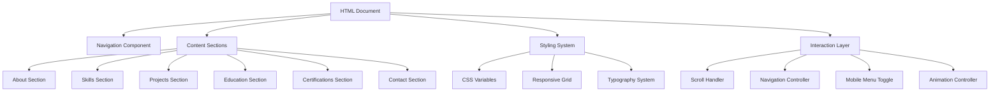

# Design Document: Portfolio Website

## Overview

The portfolio website is a single-page application (SPA) that presents Sanjay Shrish S's professional profile in a modern, responsive, and accessible format. The design follows a component-based architecture with clear separation between presentation, data, and navigation logic.

The website will be built using HTML5, CSS3, and vanilla JavaScript to ensure broad compatibility, fast loading times, and minimal dependencies. The design emphasizes clean aesthetics, smooth user interactions, and mobile-first responsive design principles.

### Key Design Principles

1. **Mobile-First Responsive Design**: Start with mobile layout and progressively enhance for larger screens
2. **Component-Based Architecture**: Modular, reusable components for maintainability
3. **Progressive Enhancement**: Core content accessible without JavaScript, enhanced with interactivity
4. **Performance-Focused**: Optimized assets, lazy loading, and minimal dependencies
5. **Accessibility-First**: Semantic HTML, ARIA labels, keyboard navigation, and screen reader support

## Architecture

### High-Level Architecture



### Technology Stack

- **HTML5**: Semantic markup for content structure
- **CSS3**: Styling with CSS Grid, Flexbox, and CSS Variables
- **JavaScript (ES6+)**: Interaction logic and dynamic behavior
- **No Framework**: Vanilla implementation for maximum performance and minimal bundle size

### File Structure

```
portfolio-website/
├── index.html              # Main HTML document
├── css/
│   ├── variables.css       # CSS custom properties (colors, spacing, typography)
│   ├── reset.css          # CSS reset for cross-browser consistency
│   ├── layout.css         # Grid and layout systems
│   ├── components.css     # Reusable component styles
│   ├── sections.css       # Section-specific styles
│   └── responsive.css     # Media queries and responsive adjustments
├── js/
│   ├── navigation.js      # Navigation and scroll handling
│   ├── animations.js      # Scroll animations and transitions
│   └── main.js           # Application initialization
├── assets/
│   ├── images/           # Optimized images
│   └── icons/            # SVG icons
└── README.md             # Project documentation
```

## Components and Interfaces

### 1. Navigation Component

**Purpose**: Provides persistent navigation across all sections with smooth scrolling and active state indication.

**Structure**:
```html
<nav class="navigation" role="navigation" aria-label="Main navigation">
  <div class="nav-container">
    <a href="#" class="nav-logo">Sanjay Shrish S</a>
    <button class="nav-toggle" aria-label="Toggle navigation menu">
      <span class="hamburger"></span>
    </button>
    <ul class="nav-menu">
      <li><a href="#about" class="nav-link">About</a></li>
      <li><a href="#skills" class="nav-link">Skills</a></li>
      <li><a href="#projects" class="nav-link">Projects</a></li>
      <li><a href="#education" class="nav-link">Education</a></li>
      <li><a href="#certifications" class="nav-link">Certifications</a></li>
      <li><a href="#contact" class="nav-link">Contact</a></li>
    </ul>
  </div>
</nav>
```

**JavaScript Interface**:
```javascript
class NavigationController {
  constructor(navElement) {
    this.nav = navElement;
    this.links = navElement.querySelectorAll('.nav-link');
    this.toggle = navElement.querySelector('.nav-toggle');
    this.menu = navElement.querySelector('.nav-menu');
  }
  
  // Smooth scroll to section
  scrollToSection(sectionId) {
    const section = document.getElementById(sectionId);
    if (section) {
      section.scrollIntoView({ behavior: 'smooth', block: 'start' });
    }
  }
  
  // Update active link based on scroll position
  updateActiveLink(currentSectionId) {
    this.links.forEach(link => {
      link.classList.remove('active');
      if (link.getAttribute('href') === `#${currentSectionId}`) {
        link.classList.add('active');
      }
    });
  }
  
  // Toggle mobile menu
  toggleMobileMenu() {
    this.menu.classList.toggle('active');
    this.toggle.classList.toggle('active');
  }
}
```

### 2. About Section Component

**Purpose**: Introduces Sanjay with name, location, professional summary, and social links.

**Structure**:
```html
<section id="about" class="section about-section">
  <div class="container">
    <div class="about-content">
      <h1 class="about-name">Sanjay Shrish S</h1>
      <p class="about-location">
        <span class="icon-location" aria-hidden="true"></span>
        Bengaluru, India
      </p>
      <p class="about-summary">
        Computer Science Engineering student specializing in Machine Learning 
        and Data Science with hands-on experience in building intelligent 
        systems for real-world applications.
      </p>
      <div class="social-links">
        <a href="https://www.linkedin.com/in/sanjay-shrish-b65a47234/" 
           target="_blank" 
           rel="noopener noreferrer"
           class="social-link"
           aria-label="LinkedIn Profile">
          <span class="icon-linkedin"></span>
          LinkedIn
        </a>
        <a href="https://leetcode.com/u/Sanjay_Shrish/" 
           target="_blank" 
           rel="noopener noreferrer"
           class="social-link"
           aria-label="LeetCode Profile">
          <span class="icon-leetcode"></span>
          LeetCode
        </a>
      </div>
    </div>
  </div>
</section>
```

### 3. Skills Section Component

**Purpose**: Displays technical skills organized by category with visual tags.

**Data Structure**:
```javascript
const skillsData = {
  "Programming": ["Python", "Java", "C", "HTML/CSS"],
  "Database Management": ["MySQL"],
  "UI/UX & Design": ["Figma", "Canva"],
  "Tools & Platforms": ["Git", "Linux", "Ubuntu", "Google Colab", "Jupyter Notebook"],
  "Machine Learning & Data Science": [
    "NumPy", "Pandas", "Matplotlib", "SciPy",
    "Regression (Linear, Multiple, Polynomial, Logistic)",
    "Classification", "Clustering", "Reinforcement Learning"
  ],
  "Data Analysis": [
    "Data Cleaning", "Feature Engineering", 
    "Data Visualization", "Exploratory Data Analysis (EDA)"
  ],
  "Natural Language Processing": [
    "Text Preprocessing", "Tokenization", "Sentiment Analysis"
  ],
  "Association Rule Learning": [
    "Apriori Algorithm", "Market Basket Analysis"
  ],
  "Deep Learning": [
    "Artificial Neural Networks (ANN)", 
    "Convolutional Neural Networks (CNN)"
  ]
};
```

**Structure**:
```html
<section id="skills" class="section skills-section">
  <div class="container">
    <h2 class="section-title">Technical Skills</h2>
    <div class="skills-grid">
      <!-- Generated for each category -->
      <div class="skill-category">
        <h3 class="category-title">Programming</h3>
        <div class="skill-tags">
          <span class="skill-tag">Python</span>
          <span class="skill-tag">Java</span>
          <span class="skill-tag">C</span>
          <span class="skill-tag">HTML/CSS</span>
        </div>
      </div>
      <!-- Repeat for other categories -->
    </div>
  </div>
</section>
```

**JavaScript Interface**:
```javascript
class SkillsRenderer {
  constructor(skillsData) {
    this.data = skillsData;
  }
  
  // Render all skill categories
  render(containerElement) {
    const categories = Object.keys(this.data);
    categories.forEach(category => {
      const categoryElement = this.createCategoryElement(category, this.data[category]);
      containerElement.appendChild(categoryElement);
    });
  }
  
  // Create a single category element
  createCategoryElement(categoryName, skills) {
    const categoryDiv = document.createElement('div');
    categoryDiv.className = 'skill-category';
    
    const title = document.createElement('h3');
    title.className = 'category-title';
    title.textContent = categoryName;
    
    const tagsContainer = document.createElement('div');
    tagsContainer.className = 'skill-tags';
    
    skills.forEach(skill => {
      const tag = document.createElement('span');
      tag.className = 'skill-tag';
      tag.textContent = skill;
      tagsContainer.appendChild(tag);
    });
    
    categoryDiv.appendChild(title);
    categoryDiv.appendChild(tagsContainer);
    
    return categoryDiv;
  }
}
```

### 4. Projects Section Component

**Purpose**: Showcases projects with details in card format.

**Data Structure**:
```javascript
const projectsData = [
  {
    id: "market-basket-analysis",
    title: "Market Basket Analysis",
    dateRange: "June 2025 - July 2025",
    description: "Developed a model using the Apriori algorithm for association rule mining to identify frequent item sets and product relationships.",
    highlights: [
      "Applied data preprocessing and statistical measures (support, confidence, lift)",
      "Analyzed customer purchase patterns and product correlations",
      "Improved product recommendations and store layouts"
    ],
    technologies: ["Python", "Apriori Algorithm", "Data Preprocessing", "Association Rule Mining"]
  },
  {
    id: "sentiment-analysis",
    title: "Sentiment Analysis",
    dateRange: "Aug 2025 - Sept 2025",
    description: "Built an NLP model for text classification to classify text into positive, negative, and neutral sentiments.",
    highlights: [
      "Implemented preprocessing (tokenization, stopword removal, lemmatization)",
      "Analyzed social media and review datasets",
      "Extracted user opinions and emotional tones"
    ],
    technologies: ["Python", "NLP", "Text Classification", "Tokenization", "Sentiment Analysis"]
  },
  {
    id: "breast-cancer-detection",
    title: "Breast Cancer Detection",
    dateRange: "May 2024 - June 2025",
    description: "Developed a machine learning model using Logistic Regression to classify tumors as malignant or benign.",
    highlights: [
      "Performed data preprocessing and feature scaling",
      "Evaluated using accuracy, precision, recall, and F1-score",
      "Provided diagnostic aid for early disease detection"
    ],
    technologies: ["Python", "Logistic Regression", "Feature Scaling", "Classification", "Model Evaluation"]
  }
];
```

**Structure**:
```html
<section id="projects" class="section projects-section">
  <div class="container">
    <h2 class="section-title">Projects</h2>
    <div class="projects-grid">
      <!-- Generated for each project -->
      <article class="project-card">
        <h3 class="project-title">Market Basket Analysis</h3>
        <p class="project-date">June 2025 - July 2025</p>
        <p class="project-description">...</p>
        <ul class="project-highlights">
          <li>Applied data preprocessing and statistical measures</li>
          <!-- More highlights -->
        </ul>
        <div class="project-technologies">
          <span class="tech-tag">Python</span>
          <span class="tech-tag">Apriori Algorithm</span>
          <!-- More technologies -->
        </div>
      </article>
      <!-- Repeat for other projects -->
    </div>
  </div>
</section>
```

### 5. Education Section Component

**Purpose**: Displays educational background with institution details.

**Data Structure**:
```javascript
const educationData = [
  {
    id: "bms-institute",
    institution: "BMS Institute Of Technology And Management",
    degree: "Bachelors of Engineering in Computer Science and Engineering",
    dateRange: "Sept 2023 - Sept 2027",
    performance: "CGPA: 8.57",
    coursework: [
      "Data Structures and Algorithms",
      "Object-Oriented Programming",
      "Database Management Systems",
      "Operating Systems",
      "Computer Networks",
      "Digital Design and Computer Organization",
      "Computer Architecture",
      "Software Engineering"
    ]
  },
  {
    id: "mes-kishore-kendra",
    institution: "MES Kishore Kendra PU College",
    degree: "Pre-University College",
    dateRange: "Jul 2021 - March 2022",
    performance: "Percentage: 86%",
    coursework: null
  }
];
```

**Structure**:
```html
<section id="education" class="section education-section">
  <div class="container">
    <h2 class="section-title">Education</h2>
    <div class="education-timeline">
      <!-- Generated for each education entry -->
      <div class="education-item">
        <h3 class="institution-name">BMS Institute Of Technology And Management</h3>
        <p class="degree">Bachelors of Engineering in Computer Science and Engineering</p>
        <p class="date-range">Sept 2023 - Sept 2027</p>
        <p class="performance">CGPA: 8.57</p>
        <div class="coursework">
          <h4>Relevant Coursework:</h4>
          <ul class="coursework-list">
            <li>Data Structures and Algorithms</li>
            <!-- More courses -->
          </ul>
        </div>
      </div>
      <!-- Repeat for other education -->
    </div>
  </div>
</section>
```

### 6. Certifications Section Component

**Purpose**: Lists professional certifications with issuing organizations.

**Data Structure**:
```javascript
const certificationsData = [
  {
    id: "ml-az-udemy",
    name: "Machine Learning A–Z: AI, Python & R + ChatGPT Prize [2025]",
    organization: "Udemy",
    year: 2025
  },
  {
    id: "ai-fundamentals-ibm",
    name: "Artificial Intelligence Fundamentals",
    organization: "IBM SkillsBuild",
    year: 2025
  },
  {
    id: "google-cybersecurity",
    name: "Google Cybersecurity Professional Certificate",
    organization: "Google / Coursera",
    year: 2025
  }
];
```

**Structure**:
```html
<section id="certifications" class="section certifications-section">
  <div class="container">
    <h2 class="section-title">Certifications</h2>
    <div class="certifications-list">
      <!-- Generated for each certification -->
      <div class="certification-item">
        <h3 class="certification-name">Machine Learning A–Z: AI, Python & R + ChatGPT Prize [2025]</h3>
        <p class="certification-org">Udemy | 2025</p>
      </div>
      <!-- Repeat for other certifications -->
    </div>
  </div>
</section>
```

### 7. Contact Section Component

**Purpose**: Provides contact information with clickable links.

**Structure**:
```html
<section id="contact" class="section contact-section">
  <div class="container">
    <h2 class="section-title">Get In Touch</h2>
    <div class="contact-content">
      <p class="contact-intro">
        I'm always open to discussing new opportunities, collaborations, 
        or interesting projects in Machine Learning and Data Science.
      </p>
      <div class="contact-methods">
        <a href="mailto:s.sanjayshrish2005@gmail.com" 
           class="contact-link"
           aria-label="Send email">
          <span class="icon-email" aria-hidden="true"></span>
          <span class="contact-text">s.sanjayshrish2005@gmail.com</span>
        </a>
        <a href="tel:+918073834489" 
           class="contact-link"
           aria-label="Call phone number">
          <span class="icon-phone" aria-hidden="true"></span>
          <span class="contact-text">+91-8073834489</span>
        </a>
        <a href="https://www.linkedin.com/in/sanjay-shrish-b65a47234/" 
           target="_blank" 
           rel="noopener noreferrer"
           class="contact-link"
           aria-label="LinkedIn Profile">
          <span class="icon-linkedin" aria-hidden="true"></span>
          <span class="contact-text">LinkedIn Profile</span>
        </a>
        <a href="https://leetcode.com/u/Sanjay_Shrish/" 
           target="_blank" 
           rel="noopener noreferrer"
           class="contact-link"
           aria-label="LeetCode Profile">
          <span class="icon-leetcode" aria-hidden="true"></span>
          <span class="contact-text">LeetCode Profile</span>
        </a>
      </div>
    </div>
  </div>
</section>
```

### 8. Responsive Layout System

**Purpose**: Ensures proper display across all device sizes using CSS Grid and Flexbox.

**Breakpoints**:
```css
/* CSS Variables for breakpoints */
:root {
  --breakpoint-mobile: 320px;
  --breakpoint-tablet: 768px;
  --breakpoint-desktop: 1024px;
  --breakpoint-wide: 1440px;
}
```

**Media Query Strategy**:
```css
/* Mobile-first base styles */
.container {
  width: 100%;
  padding: 0 1rem;
  max-width: var(--breakpoint-wide);
  margin: 0 auto;
}

/* Tablet and up */
@media (min-width: 768px) {
  .container {
    padding: 0 2rem;
  }
  
  .projects-grid {
    grid-template-columns: repeat(2, 1fr);
  }
}

/* Desktop and up */
@media (min-width: 1024px) {
  .container {
    padding: 0 3rem;
  }
  
  .projects-grid {
    grid-template-columns: repeat(3, 1fr);
  }
  
  .nav-menu {
    display: flex;
  }
  
  .nav-toggle {
    display: none;
  }
}
```

### 9. Scroll Handler

**Purpose**: Manages scroll-based interactions including active navigation state and scroll animations.

**JavaScript Interface**:
```javascript
class ScrollHandler {
  constructor() {
    this.sections = document.querySelectorAll('.section');
    this.observerOptions = {
      root: null,
      rootMargin: '-50% 0px -50% 0px',
      threshold: 0
    };
  }
  
  // Initialize Intersection Observer for section detection
  init(callback) {
    const observer = new IntersectionObserver((entries) => {
      entries.forEach(entry => {
        if (entry.isIntersecting) {
          callback(entry.target.id);
        }
      });
    }, this.observerOptions);
    
    this.sections.forEach(section => observer.observe(section));
  }
  
  // Get current visible section
  getCurrentSection() {
    const scrollPosition = window.scrollY + window.innerHeight / 2;
    
    for (let section of this.sections) {
      const sectionTop = section.offsetTop;
      const sectionBottom = sectionTop + section.offsetHeight;
      
      if (scrollPosition >= sectionTop && scrollPosition < sectionBottom) {
        return section.id;
      }
    }
    
    return null;
  }
}
```

## Data Models

### Portfolio Data Model

The portfolio data is structured as a JavaScript object containing all content:

```javascript
const portfolioData = {
  personal: {
    name: "Sanjay Shrish S",
    location: "Bengaluru, India",
    email: "s.sanjayshrish2005@gmail.com",
    phone: "+91-8073834489",
    summary: "Computer Science Engineering student specializing in Machine Learning and Data Science with hands-on experience in building intelligent systems for real-world applications.",
    social: {
      linkedin: "https://www.linkedin.com/in/sanjay-shrish-b65a47234/",
      leetcode: "https://leetcode.com/u/Sanjay_Shrish/"
    }
  },
  
  skills: {
    // As defined in Skills Section Component
  },
  
  projects: [
    // As defined in Projects Section Component
  ],
  
  education: [
    // As defined in Education Section Component
  ],
  
  certifications: [
    // As defined in Certifications Section Component
  ]
};
```

### Section Model

Each section follows a consistent structure:

```javascript
class Section {
  constructor(id, title, content) {
    this.id = id;              // Unique identifier for navigation
    this.title = title;        // Display title
    this.content = content;    // Section-specific content data
    this.visible = false;      // Visibility state for animations
  }
  
  // Check if section is in viewport
  isInViewport() {
    const element = document.getElementById(this.id);
    if (!element) return false;
    
    const rect = element.getBoundingClientRect();
    return (
      rect.top >= 0 &&
      rect.left >= 0 &&
      rect.bottom <= window.innerHeight &&
      rect.right <= window.innerWidth
    );
  }
}
```


## Correctness Properties

*A property is a characteristic or behavior that should hold true across all valid executions of a system—essentially, a formal statement about what the system should do. Properties serve as the bridge between human-readable specifications and machine-verifiable correctness guarantees.*

### Property 1: Navigation Link Functionality

*For any* navigation link in the navigation menu, clicking that link should result in the corresponding section being scrolled into view or displayed.

**Validates: Requirements 1.2**

### Property 2: Navigation Accessibility During Scroll

*For any* scroll position on the page, the navigation system should remain accessible and visible to the user.

**Validates: Requirements 1.3**

### Property 3: External Links Open in New Tab

*For any* external link (social media links, profile links), the link should have `target="_blank"` and `rel="noopener noreferrer"` attributes to open in a new tab securely.

**Validates: Requirements 2.5**

### Property 4: Skill Category Completeness

*For any* skill category in the skills data, all skills associated with that category should be displayed in the rendered output.

**Validates: Requirements 3.3**

### Property 5: Project Card Completeness

*For any* project in the projects data, there should be a corresponding project card element that contains the project title, date range, description, technologies, and highlights.

**Validates: Requirements 4.1, 4.2, 4.4**

### Property 6: Education Entry Completeness

*For any* education entry in the education data, there should be a corresponding display element that contains the institution name, degree/program, date range, and academic performance.

**Validates: Requirements 5.1, 5.2**

### Property 7: Certification Entry Completeness

*For any* certification in the certifications data, the displayed certification should include the certification name, issuing organization, and year obtained.

**Validates: Requirements 6.2**

### Property 8: Certification Chronological Ordering

*For any* two consecutive certifications in the displayed list, the first certification's year should be greater than or equal to the second certification's year (reverse chronological order).

**Validates: Requirements 6.4**

### Property 9: Responsive Layout Adaptation

*For any* viewport width change, the layout should dynamically adjust without requiring a page reload, applying the appropriate CSS media query styles.

**Validates: Requirements 8.4**

### Property 10: Text Readability Across Devices

*For any* viewport size (mobile, tablet, desktop), all text elements should have font sizes at or above the minimum readable size (14px for body text, 16px for mobile).

**Validates: Requirements 8.5**

### Property 11: Image Alternative Text

*For any* image element in the website, the element should have a non-empty `alt` attribute providing alternative text.

**Validates: Requirements 10.1**

### Property 12: Keyboard Navigation Support

*For any* interactive element (links, buttons, form inputs), the element should be keyboard accessible with proper focus states and logical tab order.

**Validates: Requirements 10.2**

### Property 13: Color Contrast Compliance

*For any* text element and its background, the color contrast ratio should meet WCAG AA standards (minimum 4.5:1 for normal text, 3:1 for large text).

**Validates: Requirements 10.3**

### Property 14: Semantic HTML Structure

*For any* major content section, the HTML should use semantic elements (nav, section, article, header, footer) and include appropriate ARIA labels where needed for screen reader accessibility.

**Validates: Requirements 10.4**

## Error Handling

### Navigation Errors

**Missing Section Target**:
- If a navigation link references a section ID that doesn't exist, the scroll handler should fail gracefully without throwing errors
- Log a warning to the console for debugging
- Prevent default link behavior to avoid page jumps

**Scroll Interference**:
- If smooth scrolling is not supported by the browser, fall back to instant scrolling
- Detect browser support using `CSS.supports('scroll-behavior', 'smooth')`

### Data Rendering Errors

**Missing Data Fields**:
- If a required field is missing from the data (e.g., project title), display a placeholder or skip rendering that item
- Log warnings for missing required fields during development
- Ensure the page doesn't break due to undefined values

**Invalid Data Types**:
- Validate data types before rendering (e.g., arrays for skills, strings for names)
- Use default values for invalid data
- Example: If `skills` is not an array, default to empty array `[]`

### Responsive Design Errors

**Viewport Detection**:
- If viewport width cannot be determined, default to mobile layout (safest fallback)
- Use `window.innerWidth` with fallback to `document.documentElement.clientWidth`

**Media Query Support**:
- Ensure base mobile styles work without media query support
- Progressive enhancement approach: mobile-first, then enhance for larger screens

### Accessibility Errors

**Missing ARIA Labels**:
- If an interactive element lacks an accessible name, provide a fallback using `title` attribute
- Validate during development that all interactive elements have labels

**Focus Management**:
- If focus is lost during navigation, return focus to a logical element (navigation menu or section heading)
- Implement focus trap for mobile menu when open

## Testing Strategy

### Dual Testing Approach

The portfolio website will be tested using both **unit tests** and **property-based tests** to ensure comprehensive coverage:

- **Unit Tests**: Verify specific examples, edge cases, and integration points
- **Property Tests**: Verify universal properties across all inputs and data variations

Both testing approaches are complementary and necessary for ensuring correctness.

### Unit Testing Focus

Unit tests will focus on:

1. **Specific Examples**:
   - Verify the About section contains Sanjay's name and location
   - Verify all three specific projects are displayed (Market Basket Analysis, Sentiment Analysis, Breast Cancer Detection)
   - Verify specific certifications are present
   - Verify contact information is correctly displayed

2. **Edge Cases**:
   - Empty data arrays (no projects, no certifications)
   - Missing optional fields (e.g., coursework for education entries)
   - Very long text content (project descriptions, skill names)
   - Special characters in text content

3. **Integration Points**:
   - Navigation click triggers scroll to correct section
   - Mobile menu toggle shows/hides menu
   - External links have correct attributes
   - Email/phone links have correct href formats

4. **Responsive Behavior**:
   - Layout at mobile breakpoint (320px, 375px, 414px)
   - Layout at tablet breakpoint (768px, 834px)
   - Layout at desktop breakpoint (1024px, 1440px, 1920px)

### Property-Based Testing Focus

Property-based tests will verify universal correctness properties using **fast-check** (JavaScript property-based testing library). Each test will run a minimum of 100 iterations with randomized inputs.

Property tests will focus on:

1. **Data Rendering Properties**:
   - For any project data, verify complete rendering (Property 5)
   - For any education data, verify complete rendering (Property 6)
   - For any certification data, verify complete rendering (Property 7)
   - For any skill category, verify all skills are displayed (Property 4)

2. **Navigation Properties**:
   - For any navigation link, verify scroll behavior (Property 1)
   - For any scroll position, verify navigation remains accessible (Property 2)

3. **Link Properties**:
   - For any external link, verify new tab attributes (Property 3)

4. **Accessibility Properties**:
   - For any image, verify alt text exists (Property 11)
   - For any interactive element, verify keyboard accessibility (Property 12)
   - For any text/background pair, verify contrast ratio (Property 13)
   - For any section, verify semantic HTML (Property 14)

5. **Responsive Properties**:
   - For any viewport width, verify layout adaptation (Property 9)
   - For any viewport size, verify text readability (Property 10)

6. **Ordering Properties**:
   - For any two consecutive certifications, verify chronological order (Property 8)

### Property Test Configuration

Each property-based test will:
- Use **fast-check** library for JavaScript
- Run minimum **100 iterations** per test
- Include a comment tag referencing the design property:
  ```javascript
  // Feature: portfolio-website, Property 5: Project Card Completeness
  // Validates: Requirements 4.1, 4.2, 4.4
  ```

### Test File Structure

```
tests/
├── unit/
│   ├── navigation.test.js
│   ├── sections.test.js
│   ├── responsive.test.js
│   └── accessibility.test.js
├── properties/
│   ├── data-rendering.property.test.js
│   ├── navigation.property.test.js
│   ├── links.property.test.js
│   ├── accessibility.property.test.js
│   └── responsive.property.test.js
└── integration/
    └── end-to-end.test.js
```

### Testing Tools

- **Test Framework**: Jest or Vitest
- **Property-Based Testing**: fast-check
- **DOM Testing**: jsdom or happy-dom
- **Accessibility Testing**: axe-core
- **Visual Regression**: Percy or Chromatic (optional)

### Continuous Integration

- Run all tests on every commit
- Enforce minimum code coverage (80% for unit tests)
- Enforce all property tests pass (100% pass rate)
- Run accessibility audits using Lighthouse CI
- Test on multiple browsers (Chrome, Firefox, Safari, Edge)

### Manual Testing Checklist

In addition to automated tests:
- Test on real mobile devices (iOS and Android)
- Test with screen readers (NVDA, JAWS, VoiceOver)
- Test keyboard navigation without mouse
- Test on slow network connections (3G simulation)
- Verify print styles (if applicable)
